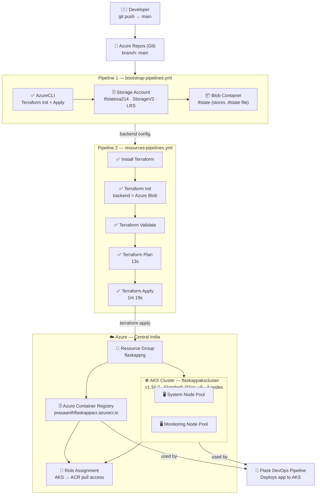
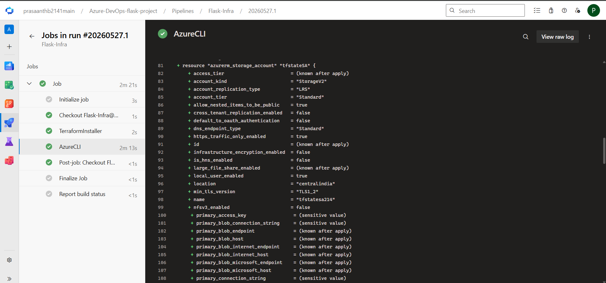
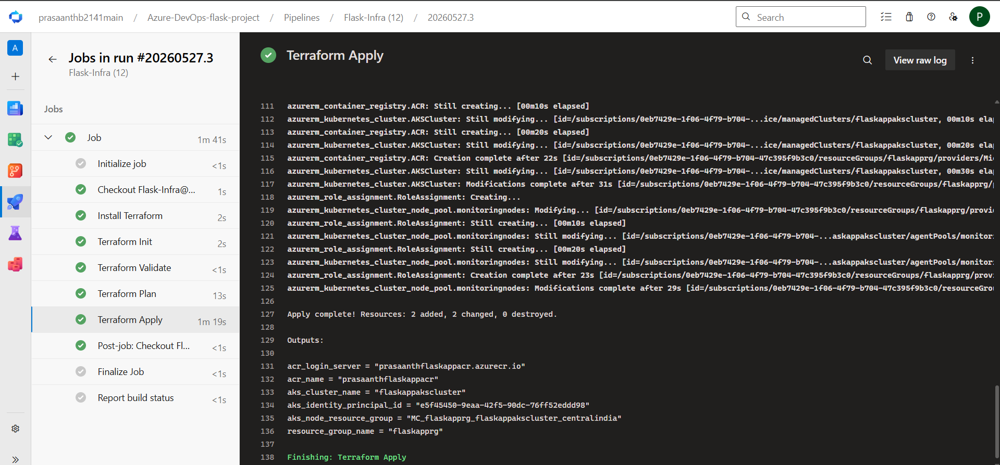

# 🏗️ Flask-Infra — Azure Infrastructure as Code (Terraform)

     

Infrastructure as Code (IaC) project that **automatically provisions** the entire Azure infrastructure required for the [Azure-DevOps-FlaskApp-Pipeline](https://github.com/PrasaanthB/Azure-DevOps-FlaskApp-Pipeline) project — using **Terraform** and **Azure DevOps Pipelines**.

> 📝 Two pipelines work together: `bootstrap-pipelines.yml` creates the remote state backend first, then `resources-pipelines.yml` provisions AKS and ACR using that backend.

---

## 📌 What This Provisions

| Resource | Name | Purpose |
|----------|------|---------|
| **Resource Group** | `flaskapprg` | Container for all resources |
| **Storage Account** | `tfstatesa214` | Stores Terraform remote state |
| **Blob Container** | `tfstate` | Holds the `.tfstate` file |
| **AKS Cluster** | `flaskappakscluster` | Kubernetes cluster for app deployment |
| **ACR** | `prasaanthflaskappacr` | Docker image registry |

---

## 🏗️ Architecture Diagram



---

## 📁 Project Structure

```
Flask-Infra/
├── bootstrap/
│   ├── main.tf           → Storage Account + Blob Container (tfstate backend)
│   └── provider.tf       → Azure provider config
│
├── resources/
│   ├── backend.tf        → Remote state config (points to bootstrap storage)
│   ├── main.tf           → AKS Cluster + ACR + Role Assignment
│   ├── output.tf         → Outputs: ACR login server, AKS cluster name, RG name
│   ├── provider.tf       → Azure provider + required versions
│   ├── terraform.tfvars  → Variable values (region, names, node sizes)
│   └── variables.tf      → Variable declarations
│
├── bootstrap-pipelines.yml   → Azure DevOps pipeline for bootstrap
├── resources-pipelines.yml   → Azure DevOps pipeline for AKS + ACR
├── .gitignore
└── README.md
```

---

## ⚙️ Pipeline 1 — Bootstrap (State Backend)

**File:** `bootstrap-pipelines.yml`

Creates the **remote Terraform state backend** in Azure — so the state file is stored safely in the cloud, not locally.

### What it creates:
```hcl
resource "azurerm_storage_account" "tfstateSA" {
  name                     = "tfstatesa214"
  account_kind             = "StorageV2"
  account_replication_type = "LRS"
  account_tier             = "Standard"
  location                 = "centralindia"
  https_traffic_only_enabled = true
}

resource "azurerm_storage_container" "tfstate" {
  name = "tfstate"
}
```

### Pipeline steps:
| Step | Duration | Result |
|------|----------|--------|
| Initialize job | 3s | ✅ |
| Checkout Flask-Infra | 1s | ✅ |
| TerraformInstaller | 2s | ✅ |
| AzureCLI (init + apply) | 2m 13s | ✅ |

---

## ⚙️ Pipeline 2 — Resources (AKS + ACR)

**File:** `resources-pipelines.yml`

Provisions the actual infrastructure — AKS cluster and ACR — using the remote backend created by Pipeline 1.

### What it creates:
- **AKS Cluster** — `flaskappakscluster` with 2 node pools
- **ACR** — `prasaanthflaskappacr.azurecr.io`
- **Role Assignment** — AKS gets pull access to ACR

### Terraform Apply output:
```
Apply complete! Resources: 2 added, 2 changed, 0 destroyed.

Outputs:
acr_login_server       = "prasaanthflaskappacr.azurecr.io"
acr_name               = "prasaanthflaskappacr"
aks_cluster_name       = "flaskappakscluster"
aks_node_resource_group = "MC_flaskapprg_flaskappakscluster_centralindia"
resource_group_name    = "flaskapprg"
```

### Pipeline steps:
| Step | Duration | Result |
|------|----------|--------|
| Initialize job | <1s | ✅ |
| Checkout Flask-Infra | 1s | ✅ |
| Install Terraform | 2s | ✅ |
| Terraform Init | 2s | ✅ |
| Terraform Validate | <1s | ✅ |
| Terraform Plan | 13s | ✅ |
| Terraform Apply | 1m 19s | ✅ |

---

## 🔧 Key Terraform Resources

### AKS Cluster
```hcl
resource "azurerm_kubernetes_cluster" "AKSCluster" {
  name                = var.aks_cluster_name       # flaskappakscluster
  location            = var.location               # centralindia
  resource_group_name = var.resource_group_name    # flaskapprg
  kubernetes_version  = "1.34.7"
  dns_prefix          = "flaskappaks"

  default_node_pool {
    name       = "system"
    node_count = 2
    vm_size    = "Standard_D2as_v6"
  }

  identity {
    type = "SystemAssigned"
  }
}
```

### Azure Container Registry
```hcl
resource "azurerm_container_registry" "ACR" {
  name                = var.acr_name              # prasaanthflaskappacr
  resource_group_name = var.resource_group_name
  location            = var.location
  sku                 = "Basic"
  admin_enabled       = true
}
```

### Role Assignment (AKS → ACR)
```hcl
resource "azurerm_role_assignment" "RoleAssignment" {
  principal_id         = azurerm_kubernetes_cluster.AKSCluster.kubelet_identity[0].object_id
  role_definition_name = "AcrPull"
  scope                = azurerm_container_registry.ACR.id
}
```

---

## 🚀 How to Run Locally

### Prerequisites
- Terraform >= 1.0
- Azure CLI
- Azure DevOps access

### Step 1 — Run Bootstrap (one time only)
```bash
cd bootstrap/
az login
terraform init
terraform plan
terraform apply
```

### Step 2 — Run Resources
```bash
cd resources/
terraform init   # connects to remote backend
terraform plan
terraform apply
```

### Step 3 — Verify
```bash
az aks list --output table
az acr list --output table
```

---

## 📊 Terraform Outputs

| Output | Value |
|--------|-------|
| `acr_login_server` | `prasaanthflaskappacr.azurecr.io` |
| `acr_name` | `prasaanthflaskappacr` |
| `aks_cluster_name` | `flaskappakscluster` |
| `aks_node_resource_group` | `MC_flaskapprg_flaskappakscluster_centralindia` |
| `resource_group_name` | `flaskapprg` |

---

## 📸 Screenshots

### Bootstrap Pipeline — Storage Account Created


### Resources Pipeline — AKS + ACR Provisioned


---

## 🔗 Related Repository

This infra repo works together with the app deployment repo:

👉 **[Azure-DevOps-FlaskApp-Pipeline](https://github.com/PrasaanthB/Azure-DevOps-FlaskApp-Pipeline)** — CI/CD pipeline that deploys the Flask app onto the AKS cluster provisioned here.

---

## 🎯 Key Achievements

- ✅ **Two-stage infra pipeline** — bootstrap backend first, then provision resources
- ✅ **Remote Terraform state** stored securely in Azure Blob Storage
- ✅ **AKS + ACR** fully automated — zero manual portal clicks
- ✅ **Role assignment** automated — AKS can pull images from ACR without credentials
- ✅ **Reusable** — destroy and recreate entire infra in under 5 minutes

---

## 📚 What I Learned

- Structuring Terraform projects with separate bootstrap and resource modules
- Managing Terraform remote state in Azure Blob Storage
- Provisioning AKS clusters and ACR using Terraform AzureRM provider
- Automating `terraform init`, `validate`, `plan`, `apply` in Azure DevOps
- Configuring RBAC role assignments between Azure services using Terraform

---

## 👨‍💻 Author

**Prasaanth B**
DevOps Engineer | Azure DevOps | Terraform | Kubernetes | Docker | Python | Prometheus | Grafana | Azure Cloud | AWS Cloud
📧 prasaanthbalaji3@gmail.com
🔗 [GitHub](https://github.com/PrasaanthB)

---

> ⭐ If you found this project useful, please give it a star!
